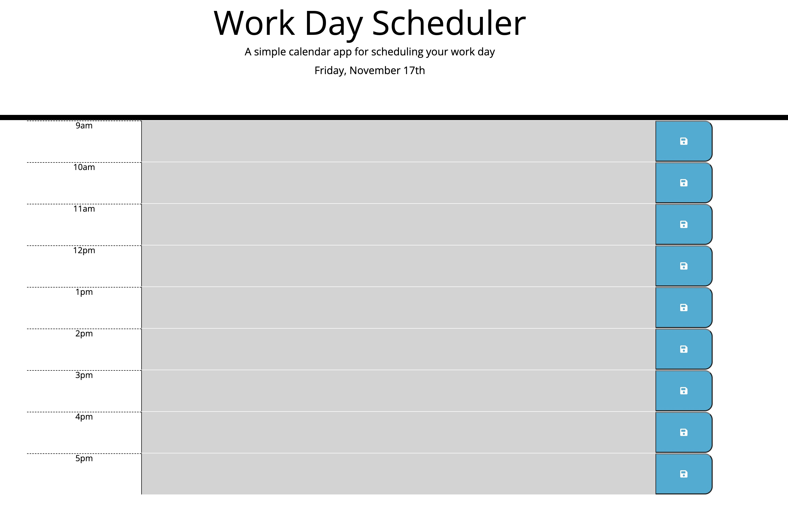

 # Third-Party APIs: Work Day Scheduler

## Description
This project is adynamic work scheduler that allows us to save to do's for the day and depending on the hour it shows past present and future, perfect for someone that is really busy, like you.

## Visuals

screenshot of working application:
  

Link to deployed application = https://aleks-ianu.github.io/DailyCalendar/

## License

MIT Licence.

